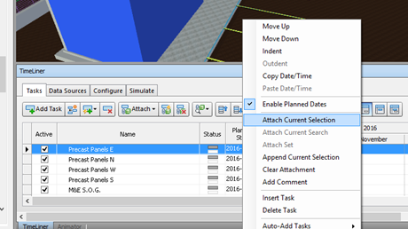

## Background on '5D' information
BIM employs parametric geometry. A model that is parameterized means it consists of a suite of variables.  
These variables matter in construction per design intent. 
Examples include:
* Usable floor space, per economic considerations
* Maximum span of joists, per structural considerations
* Daylight admitted, per human health and comfort considerations

We can alter dependent variables as we see fit with BIM but keep in mind the realities of construction that demand certain variables in certain configurations. 
These key variables tend to form codified requirements of buildings, like a foundation that is resistant to frost in cold climates.

## Getting to '5D'

What is particularly exciting about parametric models is the ability to simulate experimental variables, like time or cost from various data sources, 
as if they are linked to the representative geometry. 

In the GUI image below, any building elements of the ___model tree___ (6) that can be seen in  ___model space___ (1), be they foundation walls, cladding panels, or HVAC equipment, 
can have unique time or cost parameters. As seen in the ___timeliner___ (3), time can be sub-divided or left as the total combined estimates for length of construction, 
installation, or operational lifespan.  

So long as data sources are __attached__ _[links to a redacted section on Attachment]_ to geometry, like in the image below, when __design changes__ call for increased floor space and thus more foundation wall for example, 
the labour-time and material associated with the foundation system increases proportionally.

Similarly, when __operations changes__ call for HVAC unit replacement, or additional industrial equipment on the floor, capital expenditures, energy usage, and labour-time for 
maintenance will update in their respective operations dashboards.
